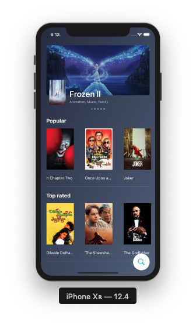
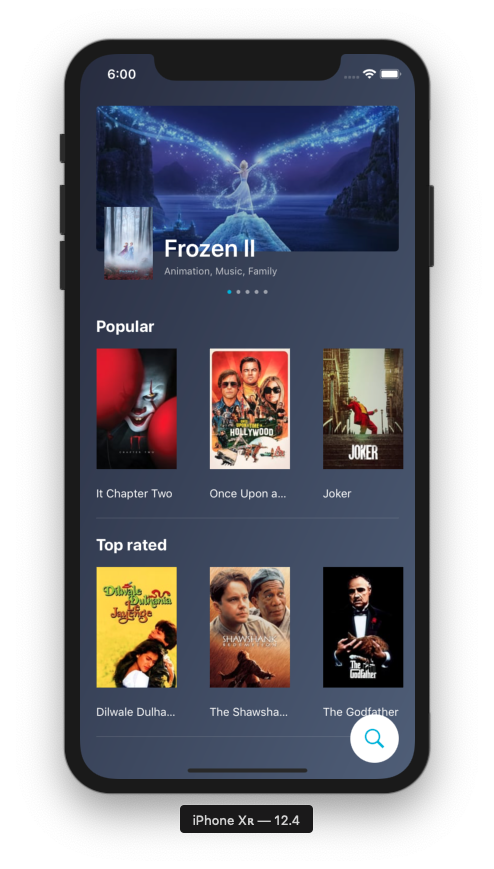
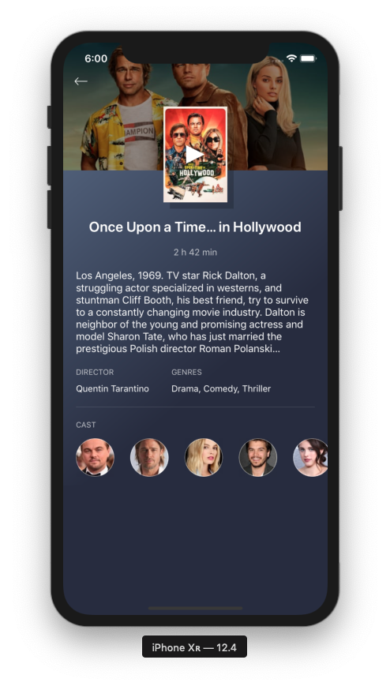
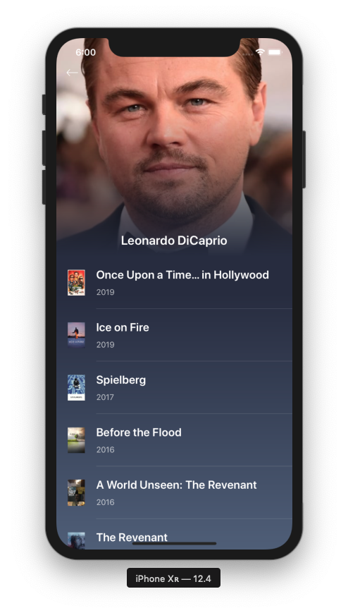
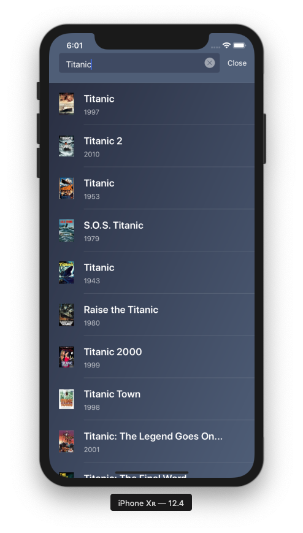

# Swift movies

Purpose of this reposity is to dive into Swift by building [this application](https://framer.cloud/yrDqW) without any dependencies.

Things I am going to learn with this project:

- layout with code only
- http requests
- handling JSON
- adding multiple screen
- communicating between screens
- some animations

## Running the app

1. Clone repository
2. (Optional) Add your [The Movie Database API key](https://developers.themoviedb.org/3/getting-started/introduction) as value for User-Defined setting `API_KEY`
3. Build & Run from Xcode

## Screenshots

